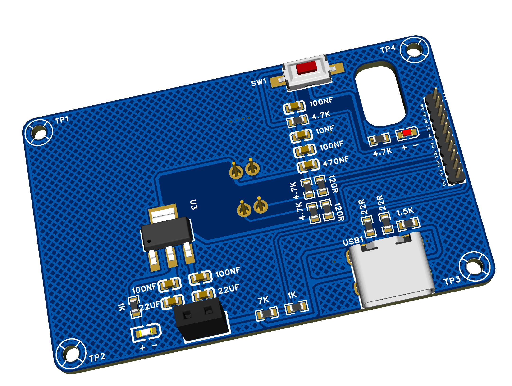

# STM32_Thermal_Mapper
工业场景中，基于STM32F4系列单片机，开发了一款手持热成像仪
## 功能描述
1.使用双线性插值算法处理传感器回传的温度数据

2.使用FATFS文件系统管理存储LCD显示画面数据

3.使用USB总线作为U盘挂载到电脑端访问FLASH芯片

4.使用VL53L0X检测被测物体与热成像仪的距离
## 电路图设计

## 3D预览

## 热成像仪V1.0

## 热成像仪V2.0

更新中。。。。。
### PCB待测试
#### 示波器检测电路板波形

#### 芯片测试

## 项目技术栈

